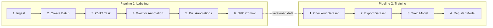
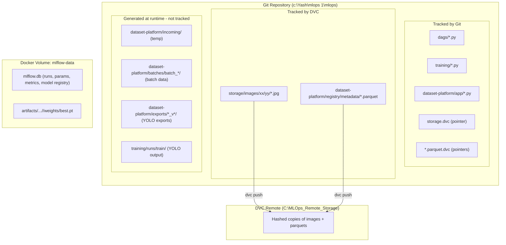

# MLOps Pipeline Flows — Complete Breakdown

This document details every step of both pipelines, their **inputs**, **outputs**, and **exactly where data is stored**.

---

## Architecture Overview



---

## Volume Mapping (Host → Docker)

| Host Path | Container Path | Used By |
|---|---|---|
| `c:\Yash\mlops 1\mlops\` (entire repo) | `/opt/mlops` | Airflow |
| `C:\MLOps_Remote_Storage` | `/opt/remote_storage` | DVC remote |
| Docker volume `mlflow-data` | `/opt/mlflow` | MLflow server + Airflow |
| Docker volume `postgres-data` | `/var/lib/postgresql/data` | Airflow metadata DB |

---

## Pipeline 1: `labeling_pipeline` (DAG)

> **Trigger**: Manual (Airflow UI or API). No schedule.

### Step 1 — Ingest Images

| | Details |
|---|---|
| **Script** | [ingest.py](file:///c:/Yash/mlops%201/mlops/dataset-platform/app/ingest.py) |
| **Input** | Raw images dropped into `/opt/mlops/dataset-platform/incoming/` (host: `mlops\dataset-platform\incoming\`) |
| **DAG config input** | `source_id` (default: `"manual_upload"`) |
| **What it does** | 1. Scans the `incoming/` folder for image files<br>2. Computes a **SHA-256 hash** of each image → becomes `image_id`<br>3. Moves the image into **sharded storage**: `storage/images/<first2>/<next2>/<hash>.jpg`<br>4. Appends a row to the images registry<br>5. Deletes the file from `incoming/` |
| **Output (files)** | Images moved to `storage/images/xx/yy/<image_id>.ext` |
| **Output (registry)** | `dataset-platform/registry/metadata/images.parquet` — updated with new rows |

**`images.parquet` schema:**
| Column | Description |
|---|---|
| `image_id` | SHA-256 hash (unique) |
| `path` | Absolute path in container |
| `source_id` | Origin identifier |
| `ingested_at` | UTC ISO timestamp |

---

### Step 2 — Create Batch

| | Details |
|---|---|
| **Script** | [create_batch.py](file:///c:/Yash/mlops%201/mlops/dataset-platform/app/create_batch.py) + [select_images.py](file:///c:/Yash/mlops%201/mlops/dataset-platform/app/select_images.py) |
| **Input** | `images.parquet`, `labels.parquet` (to find unlabeled), `exclusions.parquet` (to skip excluded) |
| **DAG config inputs** | `label_set` (default: `"default"`), `batch_size` (default: `10`) |
| **What it does** | 1. Queries `images.parquet` for all images<br>2. Removes images already labeled for this `label_set` (from `labels.parquet`)<br>3. Removes excluded images (from `exclusions.parquet`)<br>4. Takes the **newest** `batch_size` images<br>5. Creates a timestamped batch folder |
| **Output (files)** | A new folder: `dataset-platform/batches/batch_YYYYMMDD_HHMMSS/` containing: |

**Batch folder contents:**

| File | Description |
|---|---|
| `manifest.parquet` | Snapshot of selected images (image_id, path, cvat_name) |
| `filelist.txt` | One image path per line (for CVAT) |
| `info.yaml` | Batch metadata: batch_id, label_set, created_at, num_images |

**Output (XCom):** Returns `batch_id` string → passed to downstream tasks.

---

### Step 3 — Create CVAT Task

| | Details |
|---|---|
| **Script** | [create_task.py](file:///c:/Yash/mlops%201/mlops/dataset-platform/app/integrations/cvat/create_task.py) |
| **Input** | `batch_id` from Step 2 (via XCom), `filelist.txt` from batch folder |
| **DAG config inputs** | `cvat_project` (default: `"MyProject"`), `labels` (default: `["car", "truck", "bus"]`) |
| **What it does** | 1. Connects to CVAT API (at `http://host.docker.internal:8080`)<br>2. Creates/finds the CVAT project<br>3. Creates a CVAT task for this batch<br>4. Attaches images via shared storage paths<br>5. Saves `cvat_task_id` back into `info.yaml` |
| **Output (files)** | Updates `batches/<batch_id>/info.yaml` with `cvat_task_id` |
| **Output (CVAT)** | A labeling task visible in the CVAT UI |
| **Output (XCom)** | Returns `cvat_task_id` → passed to downstream |

---

### Step 4 — Wait for Annotation

| | Details |
|---|---|
| **Script** | Inline sensor in [labeling_pipeline.py](file:///c:/Yash/mlops%201/mlops/dags/labeling_pipeline.py) |
| **Input** | `cvat_task_id` from Step 3 (via XCom) |
| **What it does** | Polls CVAT API every **60 seconds** checking if all jobs in the task have `state == "completed"`. Timeout: **7 days**. |
| **Output** | Boolean — proceeds when all jobs are done. **No files written.** |

> ⏸️ **Human-in-the-loop**: An annotator must open CVAT, draw bounding boxes, and mark jobs as completed before this step passes.

---

### Step 5 — Pull Annotations

| | Details |
|---|---|
| **Script** | [pull_annotations.py](file:///c:/Yash/mlops%201/mlops/dataset-platform/app/pull_annotations.py) |
| **Input** | `batch_id` (XCom), `cvat_task_id` (from `info.yaml`), CVAT API |
| **What it does** | 1. Exports annotations from CVAT in COCO JSON format<br>2. Parses bounding boxes into rows<br>3. **Replaces** old annotations for this batch (safe to re-run)<br>4. Writes annotation + label records to parquet |
| **Output (files)** | Two parquet files updated: |

| File | Schema |
|---|---|
| `registry/metadata/annotations.parquet` | `image_id`, `label`, `x_min`, `y_min`, `x_max`, `y_max`, `label_set`, `source_task` |
| `registry/metadata/labels.parquet` | `image_id`, `label_set`, `annotator` ("cvat"), `active` |

---

### Step 6 — DVC Commit

| | Details |
|---|---|
| **Script** | Bash command in [labeling_pipeline.py](file:///c:/Yash/mlops%201/mlops/dags/labeling_pipeline.py#L151-L163) |
| **Input** | Updated `storage/` folder, updated `.parquet` files |
| **What it does** | 1. `dvc add storage` — tracks image storage with DVC<br>2. `dvc add dataset-platform/registry/metadata/*.parquet` — tracks parquet files<br>3. `dvc push -r localremote` — pushes data to `C:\MLOps_Remote_Storage`<br>4. `git add` + `git commit` — commits `.dvc` pointer files |
| **Output (files)** | |

| Location | What |
|---|---|
| `C:\MLOps_Remote_Storage` | Actual data files (images + parquets) pushed by DVC |
| `storage.dvc` | DVC pointer file (committed to Git) |
| `*.parquet.dvc` | DVC pointer files for registry parquets |
| Git history | A new commit: `"Auto-commit: Labelling batch <batch_id>"` |

> This creates a **version tag** in Git that the training pipeline can checkout later.

---

## Pipeline 2: `training_pipeline` (DAG)

> **Trigger**: Manual. No schedule.

### Step 1 — Checkout Dataset Version

| | Details |
|---|---|
| **Script** | Bash command in [training_pipeline.py](file:///c:/Yash/mlops%201/mlops/dags/training_pipeline.py#L29-L38) |
| **DAG config input** | `version` (optional — a Git commit/tag to checkout) |
| **What it does** | 1. Configures DVC remote to `/opt/remote_storage`<br>2. If a `version` is specified, runs `git checkout <version>`<br>3. Runs `dvc checkout` to restore the data files matching that Git version |
| **Output** | The filesystem under `/opt/mlops/storage/` and `/opt/mlops/dataset-platform/registry/metadata/` is restored to the requested version. **No new files created.** |

---

### Step 2 — Export Dataset

| | Details |
|---|---|
| **Script** | [prepare_export.py](file:///c:/Yash/mlops%201/mlops/dataset-platform/app/prepare_export.py) |
| **Input** | `annotations.parquet`, `images.parquet`, `exclusions.parquet` |
| **DAG config inputs** | `label_set` (default: `"default"`), `format` (default: `"yolo"`), `split` (default: `0.8`), `seed` (default: `42`) |
| **What it does** | 1. Loads annotations for the given `label_set`<br>2. Applies exclusions filter<br>3. Builds a class index from unique labels<br>4. Creates a **deterministic train/val split**<br>5. Copies images into export structure<br>6. Generates YOLO label `.txt` files (normalized bounding boxes)<br>7. **Auto-versions** the export (e.g., `default_v1`, `default_v2`, ...) |
| **Output (files)** | A new versioned folder: |

```
dataset-platform/exports/<label_set>_v<N>/
├── dataset.yaml         ← YOLOv8 config (path, train, val, nc, names)
├── export_info.yaml     ← metadata (version, split, classes, counts)
├── images/
│   ├── train/           ← training images (.jpg)
│   └── val/             ← validation images (.jpg)
└── labels/
    ├── train/           ← YOLO label files (.txt)
    └── val/             ← YOLO label files (.txt)
```

**Output (XCom):** Returns export directory path → passed to train step.

---

### Step 3 — Train Model

| | Details |
|---|---|
| **Script** | [train.py](file:///c:/Yash/mlops%201/mlops/training/train.py) |
| **Input** | `dataset.yaml` from Step 2, pre-trained weights at `/opt/mlops/model/yolov8n.pt` |
| **DAG config inputs** | `epochs` (default: `5`), `imgsz` (fixed: `640`) |
| **What it does** | 1. Loads YOLOv8n pre-trained model<br>2. Starts an **MLflow Run** under experiment `"YOLOv8_Training"`<br>3. Logs hyperparameters (epochs, imgsz, batch_size, model_path, data_config)<br>4. Trains the model using Ultralytics<br>5. Logs metrics: `map50`, `map50-95`, `precision`, `recall`<br>6. Logs artifacts: `best.pt` weights + `confusion_matrix.png`<br>7. Prints `MLFLOW_RUN_ID` for the next step |
| **Output (local files)** | Training results at `/opt/mlops/training/runs/train/` (overwritten each run) |

| File | Description |
|---|---|
| `training/runs/train/weights/best.pt` | Best model weights |
| `training/runs/train/weights/last.pt` | Last epoch weights |
| `training/runs/train/confusion_matrix.png` | Confusion matrix |
| `training/runs/train/results.png` | Training curves |

| **Output (MLflow)** | Stored in Docker volume `mlflow-data` (`/opt/mlflow/`) |

| Location | What |
|---|---|
| `/opt/mlflow/mlflow.db` | SQLite DB — run metadata, params, metrics |
| `/opt/mlflow/artifacts/<experiment_id>/<run_id>/artifacts/weights/best.pt` | Logged model artifact |
| `/opt/mlflow/artifacts/<experiment_id>/<run_id>/artifacts/confusion_matrix.png` | Logged confusion matrix |

**Output (XCom):** Returns `run_id` string → passed to register step.

---

### Step 4 — Register Model

| | Details |
|---|---|
| **Script** | [register_model.py](file:///c:/Yash/mlops%201/mlops/training/register_model.py) |
| **Input** | `run_id` from Step 3 (via XCom) |
| **DAG config input** | `model_name` (default: `"YOLOv8_Model"`) |
| **What it does** | 1. Connects to MLflow tracking server<br>2. Creates the registered model if it doesn't exist<br>3. Creates a **new model version** (Version 1, 2, 3...) linked to the run |
| **Output** | A new version entry in **MLflow Model Registry** (stored in `mlflow.db`). All previous versions are preserved. |

---

## Complete Storage Map



---

## Summary: What Gets Stored Where

| What | Where (Host) | Persistence |
|---|---|---|
| Raw images (canonical) | `mlops\storage\images\xx\yy\` | DVC-versioned |
| Image registry | `dataset-platform\registry\metadata\images.parquet` | DVC-versioned |
| Label records | `dataset-platform\registry\metadata\labels.parquet` | DVC-versioned |
| Annotation records | `dataset-platform\registry\metadata\annotations.parquet` | DVC-versioned |
| Batch snapshots | `dataset-platform\batches\batch_*\` | Local only (not versioned) |
| YOLO exports | `dataset-platform\exports\*_v*\` | Local only (not versioned) |
| YOLO training runs | `training\runs\train\` | Overwritten each run |
| MLflow runs + metrics | Docker `mlflow-data` volume → `mlflow.db` | Persistent (across runs) |
| MLflow artifacts (best.pt) | Docker `mlflow-data` volume → `artifacts/` | Persistent (each run keeps its own) |
| Model registry versions | Inside `mlflow.db` | Persistent (V1, V2, V3... all kept) |
| DVC remote backup | `C:\MLOps_Remote_Storage` | Persistent |
| Git commits (DVC pointers) | `.git` in repo | Persistent |
